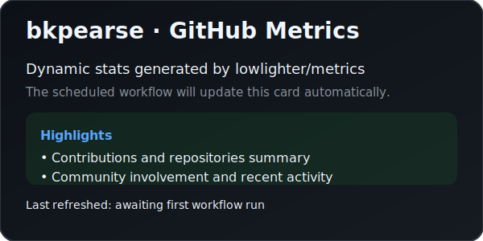

# Hi there 👋

Thanks for stopping by my profile! I'm continually refining the automation that keeps this page up-to-date, so check back soon for more dynamic content.
Welcome to my GitHub profile! I enjoy exploring new technologies, building delightful developer experiences, and sharing what I learn along the way.

## About
- 💼 Data Analyst who loves solving challenging problems with clean, pragmatic solutions.
- 🌱 Currently diving deeper into infrastructure automation and developer tooling.
- 🤝 Always excited to collaborate on open-source projects that make development more accessible.
- 🎯 Outside of coding you can find me watching Football, reading sci-fi, or experimenting in the kitchen.

## Highlights
- 📌 Browse a snapshot of my recent activity, repositories, and community involvement in the metrics card below.
- 🧰 Check out the repositories pinned on my profile for a curated list of what I have been building lately.

Thanks for stopping by! Feel free to reach out if you'd like to collaborate or just chat about tech.
